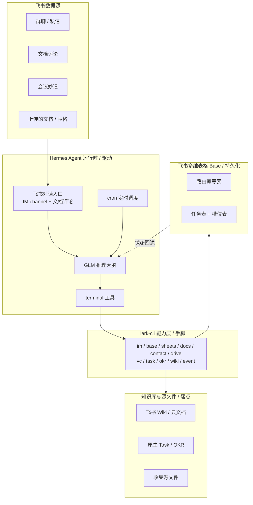

# 飞书数字员工

围绕飞书协作场景的常驻智能体,提供两类能力:被动沉淀公司知识库,主动收集结构化信息。系统以 Hermes Agent 为运行时、飞书 CLI(lark-cli)为能力层、飞书多维表格(Base)为持久化层,在飞书生态内闭环运行,不依赖任何外部数据库。

完整设计与实现契约见 [personal/飞书数字员工-设计与实现.md](personal/飞书数字员工-设计与实现.md)。

## 目录

- [系统架构](#系统架构)
- [能力构成](#能力构成)
- [技术栈与分层职责](#技术栈与分层职责)
- [数据持久化模型](#数据持久化模型)
- [数据流](#数据流)
- [目录结构](#目录结构)
- [部署](#部署)
- [测试](#测试)

## 系统架构

系统分为三层:Hermes Agent 运行时负责驱动(对话入口、推理、命令执行、定时调度);lark-cli 能力层承担一切飞书数据读写;飞书多维表格持久化层承载全部运行状态。两条能力线共用同一套三层底座。



| 层 | 组件 | 职责 |
|---|---|---|
| 运行时 | Hermes Agent | 飞书对话入口、GLM 推理、terminal 调用 lark-cli、cron 定时心跳、技能挂载 |
| 能力层 | lark-cli | 飞书全部数据读写:消息收发与加急、多维表格、电子表格、文档、通讯录、云空间、会议纪要、任务、OKR、知识库、事件订阅 |
| 持久化层 | 飞书多维表格 Base | 全部运行状态;知识库线用路由幂等表,收集线用任务表与槽位表 |

每次处理均为无状态循环:从 Base 读状态,GLM 推理决策,经 terminal 调 lark-cli 执行,再写回 Base。状态存于飞书云端,跨重启不丢失,可在飞书内直接审计。

## 能力构成

系统由两条技能线构成,各自为独立、可移植的 agentskills.io 技能,位于 [skills/](skills/)。

### 信息收集助手(feishu-collector)

主动收集。发起人上传含待填信息的文档或表格并下达指令,系统在群内或私信主动对话收集,逐项收齐后清洗、确认、写回源文件,并自动催办、收工汇报。

- 三种收集形态:表格按行收集、问题清单向特定人、开放式登记。
- 四种责任人来源:文件责任人列、指令点名、全群认领、通讯录智能匹配。
- 两道确认闸:向真人发问前的发起确认,写回文件前的复述确认。
- 内置清洗归一化:身份证、尺码、邮箱、日期等格式校验与归一,不合格自动追问。
- 定期催办:按间隔与上限挑选未交项提醒,临近截止升级为飞书加急。
- 幂等保障:写回侧以内容指纹去重,发送侧以幂等键防重复发问,抗重启不重复。

### 知识库自动维护(feishu-kb-maintainer)

被动沉淀。监听会议、群聊与文档协作,抽取要点并写入以飞书 Wiki 为骨架的知识库,涵盖七项功能。

- 会议沉淀:会议结束后抓取妙记纪要,按主题路由追加至对应项目文档。
- 群聊沉淀:按时间窗批量抽取决策、结论、待办、FAQ,过滤闲聊后更新沉淀页。
- 待办维护:将行动项写为飞书原生 Task,文档侧维护只读镜像。
- 战略目标维护:识别与关键结果相关的进展,写入原生 OKR 进展记录。
- 文档评论智能回复:读取文档正文与评论上下文,在评论串内回复。
- 智能路由与幂等:决定每条来源写入的目标文档、任务或 OKR,并按内容指纹去重。
- 周期汇总:定时将散落的决策、待办、进展汇编为周报页。

## 技术栈与分层职责

| 技术 | 角色 | 说明 |
|---|---|---|
| Hermes Agent | 运行时 | 提供 GLM 推理大脑、飞书对话入口(IM channel 与文档评论)、terminal 命令执行、cron 调度、技能挂载目录 |
| 飞书 CLI(lark-cli) | 能力层 | 经 Hermes terminal 调用,承担一切飞书数据操作;命令面以实测版本为准 |
| 飞书多维表格(Base) | 持久化层 | 全部运行状态存于飞书,不引入 SQLite 或外部数据库 |
| GLM | 推理 | 知识库线的要点抽取与目标识别,收集线的计划生成、答案映射与人名消歧 |

Hermes 对飞书的写入能力经由 terminal 调用 lark-cli 完成;其内置飞书集成仅覆盖消息收发、文档读取与评论,不含数据写入,故 lark-cli 为能力层的必要组成。

## 数据持久化模型

全部状态以飞书多维表格承载。字段定义见设计文档第四章。

### 路由幂等表(知识库线)

| 字段 | 含义 |
|---|---|
| source_type | meeting / chat / comment / manual |
| source_id | 妙记 minute_token、消息 message_id、群与时间窗、评论 comment_id |
| source_meta | 会议主题、群名、文档标题、时间 |
| target_kind | doc / task / okr / comment |
| target_id | 文档 document_id、节点 token、任务标识、关键结果标识 |
| target_locator | 落点定位:文档块、单元格、记录加字段、评论串 |
| content_hash | 内容指纹,判断是否需要更新 |
| status | written / updated / skipped |
| last_synced_at | 最近同步时间 |

### 任务表(收集线,一条记录对应一次收集活动)

主键 task_id,记录标题、状态、场所、发起群、发起人、源文件、目标文件、截止时间、催办策略、原始指令、收集计划摘要与时间戳。

### 槽位表(收集线,一条记录对应一个待收集信息点)

主键 slot_id,关联 task_id,记录字段名、对象、责任人、落点、值、状态、内容指纹、追问次数、最近询问时间与来源。状态取值:待问、已问、收到原始、清洗中、待确认、已填、跳过、不适用、待澄清。

## 数据流

### 收集线

1. 发起人在群内提及机器人并附文件,或收集对象在私信回复,经 Hermes 飞书对话入口接入。
2. GLM 读取技能指令决策,经 terminal 调 lark-cli:解析源文件结构、解析人名、发起提问与回复、写回目标、记录任务与槽位状态。
3. cron 触发催办心跳,遍历进行中任务,挑选未交项发送提醒,临近截止升级加急。

### 知识库线

1. 会议结束后由妙记生成事件触发,取纪要后查路由幂等表定位目标,追加纪要并写入待办与进展。
2. 群聊由消息事件或定时拉取触发,按时间窗累积后抽取要点,查表去重后更新沉淀页。
3. 文档评论经提及触发,读取文档正文与评论上下文后在评论串内回复。
4. cron 定时汇编周期内的决策、待办、进展为周报页。

## 目录结构

```
.
├── README.md
├── personal/
│   └── 飞书数字员工-设计与实现.md          设计与实现契约(单一真相源)
├── docs/
│   ├── pipeline/
│   │   └── env-capabilities.yaml          lark-cli 命令面与权限实测记录
│   └── superpowers/
│       └── plans/                         收集线实施计划
└── skills/
    ├── feishu-collector/                  信息收集助手
    │   ├── SKILL.md                       工作流指令(大脑)
    │   ├── package.json
    │   ├── src/                           larkcli, hash, state, clean, schedule,
    │   │                                  locator, base-io, contact, file-parse, messaging
    │   ├── bin/                           setup-base, on-message, tick
    │   └── test/
    └── feishu-kb-maintainer/              知识库自动维护
        ├── SKILL.md
        ├── package.json
        ├── src/                           larkcli, hash, route-io, minutes, kb-write,
        │                                  task-io, okr-io, comment, extract
        ├── bin/                           setup-route-base, on-event, digest
        └── test/
```

## 部署

### 前置条件

- 用户身份授权一次性完成,覆盖两条线全部 scope:

```
lark-cli auth login --scope "contact:user:search base:table:create base:table:read base:field:create base:field:read base:field:update base:view:write_only base:record:create base:record:read base:record:update sheets:spreadsheet:read sheets:spreadsheet:write_only vc:note:read task:task:write task:task:read okr:okr.progress:writeonly okr:okr.period:readonly docx:document:readonly docx:document:write_only wiki:space:read wiki:node:read wiki:node:create offline_access"
```

- 机器人发送权限:在飞书开发者后台开通 `im:message:send_as_bot` 并发布版本。
- 机器人入群:加急与群消息发送要求机器人为群成员。
- 群全量读取(知识库群聊沉淀):需敏感权限 `im:message.group_msg`(管理员审批);未获批时退化为机器人被提及时归档。

### 安装与挂载

- 将 `skills/feishu-collector` 与 `skills/feishu-kb-maintainer` 挂载至 Hermes 技能目录 `~/.hermes/skills/`。
- 在两个技能目录分别执行 `npm install`(仅开发与测试需要,运行依赖 lark-cli 与 node)。
- 运行建表脚本初始化状态库:收集线 `node skills/feishu-collector/bin/setup-base.js`,知识库线 `node skills/feishu-kb-maintainer/bin/setup-route-base.js`,将输出的库标识写入运行环境变量。
- Hermes 以常驻服务运行,通过飞书 channel 接入对话,通过系统 cron 触发催办与定时心跳。

## 测试

两条线均以单元测试覆盖确定性核心(幂等指纹、状态机、清洗归一、催办挑选、路由决策、抽取去重),不依赖网络。

```
node --test skills/feishu-collector/test/*.test.js
node --test skills/feishu-kb-maintainer/test/*.test.js
```

依赖真实飞书环境的集成测试由环境变量门控,在提供授权与测试沙箱标识后运行。

## 设计文档

[personal/飞书数字员工-设计与实现.md](personal/飞书数字员工-设计与实现.md) 为系统的设计与实现契约,涵盖功能定义、总体架构、数据模型、数据流、各功能实现路径、关键机制与部署细节。
