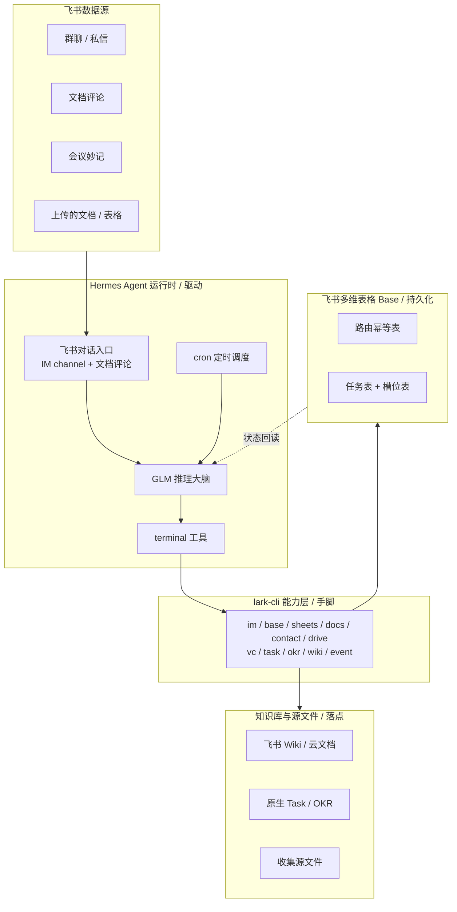

# 飞书数字员工

围绕飞书协作场景的常驻智能体,提供两类能力:被动沉淀公司知识库,主动收集结构化信息。系统以 Hermes Agent 为运行时、飞书 CLI(lark-cli)为能力层、飞书多维表格(Base)为持久化层,在飞书生态内闭环运行,不依赖任何外部数据库。

完整设计与实现契约见 [personal/飞书数字员工-设计与实现.md](personal/飞书数字员工-设计与实现.md)。

## 目录

- [系统架构](#系统架构)
- [能力构成](#能力构成)
  - [知识库标准骨架](#知识库标准骨架)
- [技术栈与分层职责](#技术栈与分层职责)
- [数据持久化模型](#数据持久化模型)
- [数据流](#数据流)
- [目录结构](#目录结构)
- [部署](#部署)
- [测试](#测试)

## 系统架构

系统分为三层:Hermes Agent 运行时负责驱动(对话入口、推理、命令执行、定时调度);lark-cli 能力层承担一切飞书数据读写;飞书多维表格持久化层承载全部运行状态。两条能力线共用同一套三层底座。



| 层 | 组件 | 职责 |
|---|---|---|
| 运行时 | Hermes Agent | 飞书对话入口、GLM 推理、terminal 调用 lark-cli、cron 定时心跳、技能挂载 |
| 能力层 | lark-cli | 飞书全部数据读写:消息收发与加急、多维表格、电子表格、文档、通讯录、云空间、会议纪要、任务、OKR、知识库、事件订阅 |
| 持久化层 | 飞书多维表格 Base | 全部运行状态;知识库线用路由幂等表,收集线用任务表与槽位表 |

每次处理均为无状态循环:从 Base 读状态,GLM 推理决策,经 terminal 调 lark-cli 执行,再写回 Base。状态存于飞书云端,跨重启不丢失,可在飞书内直接审计。

## 能力构成

系统由两条技能线构成,各自为独立、可移植的 agentskills.io 技能,位于 [skills/](skills/)。

### 信息收集助手(feishu-collector)

主动收集。发起人上传含待填信息的文档或表格并下达指令,系统在群内或私信主动对话收集,逐项收齐后清洗、确认、写回源文件,并自动催办、收工汇报。

- 三种收集形态:表格按行收集、问题清单向特定人、开放式登记。
- 四种责任人来源:文件责任人列、指令点名、全群认领、通讯录智能匹配。
- 两道确认闸:向真人发问前的发起确认,写回文件前的复述确认。
- 内置清洗归一化:身份证、尺码、邮箱、日期等格式校验与归一,不合格自动追问。
- 定期催办:按间隔与上限挑选未交项提醒,临近截止升级为飞书加急。
- 幂等保障:写回侧以内容指纹去重,发送侧以幂等键防重复发问,抗重启不重复。

### 知识库自动维护(feishu-kb-maintainer)

被动沉淀。监听会议、群聊与文档协作,抽取要点并写入以飞书 Wiki 为骨架的知识库,涵盖七项功能。

- 会议沉淀:会议结束后抓取妙记纪要,按主题路由追加至对应项目文档。
- 群聊沉淀:按时间窗批量抽取决策、结论、待办、FAQ,过滤闲聊后更新沉淀页。
- 待办维护:将行动项写为飞书原生 Task,文档侧维护只读镜像。
- 战略目标维护:识别与关键结果相关的进展,写入原生 OKR 进展记录。
- 文档评论智能回复:读取文档正文与评论上下文,在评论串内回复。
- 智能路由与幂等:决定每条来源写入的目标文档、任务或 OKR,并按内容指纹去重。
- 周期汇总:定时将散落的决策、待办、进展汇编为周报页。

### 知识库标准骨架

冷启动时由 `kb-scaffold` 原子一键搭建,在飞书知识库创建知识空间 + 7 大顶层节点(公司总览下含 3 子页)。全程幂等:已存在则复用、缺失则补建,可反复运行不重复建。

骨架是自动化流水线的**地基**——搭好后,会议纪要、群聊讨论、待办进展会自动归到对应节点,无需手动整理。

```
📁 公司知识库（知识空间）
├── 📄 公司总览
│   ├── 公司战略与年度目标
│   ├── 重要决策记录 Decision Log
│   └── 组织架构与成员
├── 📄 项目空间              每个项目一个子页面，存项目文档、进展、资料
├── 📄 会议纪要库            开完会自动把妙记/AI纪要沉淀到这里
├── 📄 群知识沉淀            群聊里的决策、待办、经验自动归档
├── 📄 公司待办看板          全公司待办事项汇总，谁负责、什么状态
├── 📄 OKR / 战略目标        季度/年度 OKR 跟踪
└── 📄 制度 / SOP / FAQ      公司制度、操作规范、常见问题
```

搭建命令(需 user 身份授权):

```bash
node skills/feishu-init/bin/init.js   # 对话中说「搭知识库」也会触发
```

## 技术栈与分层职责

| 技术 | 角色 | 说明 |
|---|---|---|
| Hermes Agent | 运行时 | 提供 GLM 推理大脑、飞书对话入口(IM channel 与文档评论)、terminal 命令执行、cron 调度、技能挂载目录 |
| 飞书 CLI(lark-cli) | 能力层 | 经 Hermes terminal 调用,承担一切飞书数据操作;命令面以实测版本为准 |
| 飞书多维表格(Base) | 持久化层 | 全部运行状态存于飞书,不引入 SQLite 或外部数据库 |
| GLM | 推理 | 知识库线的要点抽取与目标识别,收集线的计划生成、答案映射与人名消歧 |

Hermes 对飞书的写入能力经由 terminal 调用 lark-cli 完成;其内置飞书集成仅覆盖消息收发、文档读取与评论,不含数据写入,故 lark-cli 为能力层的必要组成。

## 数据持久化模型

全部状态以飞书多维表格承载。字段定义见设计文档第四章。

### 路由幂等表(知识库线)

| 字段 | 含义 |
|---|---|
| source_type | meeting / chat / comment / manual |
| source_id | 妙记 minute_token、消息 message_id、群与时间窗、评论 comment_id |
| source_meta | 会议主题、群名、文档标题、时间 |
| target_kind | doc / task / okr / comment |
| target_id | 文档 document_id、节点 token、任务标识、关键结果标识 |
| target_locator | 落点定位:文档块、单元格、记录加字段、评论串 |
| content_hash | 内容指纹,判断是否需要更新 |
| status | written / updated / skipped |
| last_synced_at | 最近同步时间 |

### 任务表(收集线,一条记录对应一次收集活动)

主键 task_id,记录标题、状态、场所、发起群、发起人、源文件、目标文件、截止时间、催办策略、原始指令、收集计划摘要与时间戳。

### 槽位表(收集线,一条记录对应一个待收集信息点)

主键 slot_id,关联 task_id,记录字段名、对象、责任人、落点、值、状态、内容指纹、追问次数、最近询问时间与来源。状态取值:待问、已问、收到原始、清洗中、待确认、已填、跳过、不适用、待澄清。

## 数据流

### 收集线

1. 发起人在群内提及机器人并附文件,或收集对象在私信回复,经 Hermes 飞书对话入口接入。
2. GLM 读取技能指令决策,经 terminal 调 lark-cli:解析源文件结构、解析人名、发起提问与回复、写回目标、记录任务与槽位状态。
3. cron 触发催办心跳,遍历进行中任务,挑选未交项发送提醒,临近截止升级加急。

### 知识库线

1. 会议结束后由妙记生成事件触发,取纪要后查路由幂等表定位目标,追加纪要并写入待办与进展。
2. 群聊由消息事件或定时拉取触发,按时间窗累积后抽取要点,查表去重后更新沉淀页。
3. 文档评论经提及触发,读取文档正文与评论上下文后在评论串内回复。
4. cron 定时汇编周期内的决策、待办、进展为周报页。

## 目录结构

```
.
├── README.md
├── personal/
│   └── 飞书数字员工-设计与实现.md          设计与实现契约(单一真相源)
├── docs/
│   ├── pipeline/
│   │   └── env-capabilities.yaml          lark-cli 命令面与权限实测记录
│   └── superpowers/
│       └── plans/                         收集线实施计划
└── skills/                               分层架构：共享底座 + 领域原子 + 编排器
    ├── feishu-shared/                     共享底座(lib，被原子与编排器 import)
    │   ├── SKILL.md
    │   ├── src/                           底座: larkcli, hash, base-crud;
    │   │                                  I/O 能力: message, contact, file, cell-write,
    │   │                                  doc, minutes, chat, task, okr, comment, im-util;
    │   │                                  体检: health
    │   └── test/
    ├── atoms/                             领域逻辑原子(各含 src + test + SKILL.md)
    │   ├── collect-store/                 任务表/槽位表 CRUD
    │   ├── collect-clean/                 清洗归一化
    │   ├── collect-slot-fsm/              槽位状态机
    │   ├── collect-nudge/                 催办挑选
    │   ├── collect-wrapup/                收工汇报(到期/全收齐)
    │   ├── kb-extract/                    抽取归类
    │   ├── kb-route/                      路由幂等 + 覆盖保护
    │   ├── kb-digest/                     周报素材选取
    │   ├── kb-scaffold/                   知识库骨架(冷启动建标准节点树)
    │   └── kb-interview/                  通用访谈模板(冷启动主动问)
    ├── feishu-init/                       编排器·书童引导(欢迎/体检/冷启动)
    │   ├── SKILL.md
    │   ├── package.json
    │   ├── src/                           intent(意图分类), cards(欢迎/菜单/体检文案)
    │   ├── bin/                           init
    │   └── test/
    ├── feishu-collector/                  编排器·信息收集助手
    │   ├── SKILL.md                       工作流指令(大脑/编排)
    │   ├── package.json
    │   └── bin/                           setup-base, on-message, tick
    └── feishu-kb-maintainer/              编排器·知识库自动维护
        ├── SKILL.md
        ├── package.json
        └── bin/                           setup-route-base, on-event, digest
```

## 部署

### 一、安装 lark-cli（飞书官方 CLI）

> ⚠️ **必须使用官方包 `@larksuite/cli`**，不要安装第三方同名包（如 `feishu-cli`，功能不同且不兼容）。

```bash
npm install -g @larksuite/cli
lark-cli --version   # 确认安装成功
```

### 二、创建飞书应用

**推荐：用 Hermes Setup Wizard（QR 扫码）自动创建应用**

> ⚠️ **顺序：先创建 Hermes profile，再在 profile 下运行 setup！** `gateway setup` 把凭证写入当前 profile 的 `.env`，profile 不存在就没地方写。

```bash
# 1. 先创建 Hermes profile
hermes profile create <profile名> --description "<公司名>飞书数字员工"

# 2. 在 profile 下运行 setup wizard（交互式）
hermes --profile <profile名> gateway setup
```

交互流程：选 Feishu/Lark → Scan QR code → 扫码 → Allow all DM → @mention in groups → Done → 不启动。

> ⚠️ **绝对不要用 `lark-cli config init --new` 创建应用！** 它只创建空壳，不会自动配置事件订阅和版本发布，导致群消息不推送。

**同步 lark-cli profile（必须！）**

Hermes QR 扫码创建了新应用（新 App ID），但 lark-cli named profile 不会自动更新，必须手动同步：

1. 编辑 `~/.lark-cli/hermes/config.json`，把对应 profile 的 `appId` 改为新 App ID
2. 用 Python AESGCM 加密 App Secret 后以**二进制格式**写入 `~/.local/share/lark-cli/appsecret_<新AppID>.enc`

### 三、配置 Hermes 飞书连接

`hermes gateway setup` 会自动写入以下配置。如果没有，手动确认 `~/.hermes/config.yaml` 包含：

```yaml
feishu:
  enabled: true
  connection_mode: websocket    # WebSocket 模式，无需公网回调地址
```

`~/.hermes/.env` 包含：

```env
FEISHU_APP_ID=cli_xxxxxxxxxxxx
FEISHU_APP_SECRET=xxxxxxxxxxxx
FEISHU_DOMAIN=feishu           # 国内版飞书用 feishu，海外版 Lark 用 lark
FEISHU_CONNECTION_MODE=websocket
GATEWAY_ALLOW_ALL_USERS=true   # 不写则 Gateway 拒绝所有消息
FEISHU_GROUP_POLICY=open       # 不写默认 allowlist，群消息全部被拒绝
FEISHU_REQUIRE_MENTION=false   # 群里不@也能看到消息（需配合飞书 group_msg 权限）
FEISHU_HOME_CHANNEL=oc_xxxxxxxxxxxxxxxx  # 群 chat_id（可选）
```

> ⚠️ **必填项说明**：`GATEWAY_ALLOW_ALL_USERS` 和 `FEISHU_GROUP_POLICY` 不写会导致消息收不到。`FEISHU_GROUP_POLICY` 可选 `open`（所有人）/ `allowlist`（需配 `FEISHU_ALLOWED_USERS`）/ `blacklist` / `disabled`。

`config.yaml` 的 `platforms.feishu` 下需要配置是否要求 @mention（默认 `true`，即群里只有 @机器人 的消息才会响应）：

```yaml
platforms:
  feishu:
    enabled: true
    connection_mode: websocket
    group_policy: open
    require_mention: false    # false = 收到所有群消息；true（默认）= 只响应 @机器人
```

> ⚠️ **两层限制**：即使 Hermes 配了 `require_mention: false`，飞书开放平台也必须开通 `im:message.group_msg`（敏感权限）才会推送不@的消息。否则飞书根本不推送，Hermes 看不到。详见 [权限配置](#八飞书开放平台权限)。

重启 Gateway 使配置生效：

```bash
hermes gateway restart
```

### 四、批准飞书配对

启动 Gateway 后，Hermes 终端会显示一个 7 位配对码（如 `QHLNC8B3`），执行：

```bash
hermes pairing approve feishu <配对码>
```

配对成功后飞书 Bot 即可收发消息。

### 五、用户身份授权

lark-cli 以 user 身份创建 Base（Bot 身份缺少 `base:table:create` 等权限）。

> ⚠️ **必须用 `--recommend` 一次性申请所有推荐 scope**（含 wiki、base、drive 等）。不带 `--recommend` 需要手动指定 scope，容易漏。

```bash
# 1. 生成授权链接
lark-cli auth login --recommend --no-wait --json

# 2. 生成二维码（--output 必须是相对路径）
lark-cli auth qrcode "<verification_url>" --output ./qrcode.png

# 3. 发给用户，等用户确认完成后再轮询
lark-cli auth login --device-code "<device_code>"
```

### 六、创建状态库 Base

用 user 身份运行建表脚本（需要先完成上一步授权）：

```bash
# 收集线：任务表 + 槽位表
node skills/feishu-collector/bin/setup-base.js

# 知识库线：路由幂等表
node skills/feishu-kb-maintainer/bin/setup-route-base.js
```

将输出的 app_token 和 table_id 写入 `~/.hermes/.env`：

```env
COLLECTOR_APP_TOKEN=SNCTbUxxxxxxxxxx
COLLECTOR_TASKS_TABLE=tblXpnMCxxxxxxxxxx
COLLECTOR_SLOTS_TABLE=tblXuxb9xxxxxxxxxx
KB_APP_TOKEN=BTzbbKxxxxxxxxxx
KB_ROUTE_TABLE=tblhXxfoxxxxxxxxxx
```

### 七、安装 Skills 到 Hermes

将本项目 skills 目录挂载到 Hermes：

```bash
cp -r skills/feishu-init ~/.hermes/skills/
cp -r skills/feishu-collector ~/.hermes/skills/
cp -r skills/feishu-kb-maintainer ~/.hermes/skills/
cp -r skills/feishu-shared ~/.hermes/skills/
cp -r skills/atoms ~/.hermes/skills/
```

在技能目录执行 `npm install` 安装运行依赖（仅开发与测试需要，生产运行依赖 lark-cli）。

### 八、飞书开放平台权限

登录 [飞书开放平台](https://open.feishu.cn/app) → 应用管理 → 权限管理，开通以下权限并**发布新版本**使其生效。

> ⚠️ **必须全部开通再发版**，否则缺少的权限会导致对应功能 403/400。逐个搜索权限标识符开通。

#### 消息（必开）

| 权限标识 | 权限名称 | 用途 |
|---|---|---|
| `im:message` | 获取与发送单聊、群组消息 | 收发消息（核心） |
| `im:message:send_as_bot` | 以应用的身份发消息 | bot 主动发消息（催办/群发/评论回复） |
| `im:message.p2p_msg:readonly` | 接收单聊消息 | 私聊收消息 |
| `im:message.group_at_msg:readonly` | 接收群聊中@本应用的消息 | 群里被@时收消息（默认） |
| `im:message.group_msg` ⚠️ | 获取群组中所有消息 | **敏感权限**，需管理员审批；配合 `require_mention: false` 实现群全量消息读取 |
| `im:resource` | 获取消息中的资源文件 | 接收图片/文件消息 |
| `im:chat` | 获取群组信息 | 查群列表/群信息 |

#### 知识库（必开）

| 权限标识 | 权限名称 | 用途 |
|---|---|---|
| `wiki:wiki` | 查看、管理知识库 | 建知识空间/节点、读写 Wiki |
| `wiki:wiki:readonly` | 查看知识库 | 体检时探测知识空间是否存在 |

#### 云文档（必开）

| 权限标识 | 权限名称 | 用途 |
|---|---|---|
| `docx:document` | 查看、评论、编辑、管理云文档 | 文档写入（知识沉淀） |
| `docx:document:readonly` | 查看云文档 | 读文档正文（覆盖保护比对） |
| `drive:drive` | 查看、编辑、管理云空间文件 | 文件导入/解析、本地文件转在线 |
| `drive:drive:readonly` | 查看云空间文件 | 读文件信息 |
| `drive:file` | 上传文件到云空间 | 上传附件 |

#### 多维表格（必开）

| 权限标识 | 权限名称 | 用途 |
|---|---|---|
| `bitable:app` | 查看、评论、编辑、管理多维表格 | 读写状态库（任务表/槽位表/路由表） |
| `bitable:app:readonly` | 查看多维表格 | 读 Base 记录 |

#### 电子表格（必开）

| 权限标识 | 权限名称 | 用途 |
|---|---|---|
| `sheets:spreadsheet` | 查看、编辑、管理电子表格 | 解析用户上传的 Excel 文件 |
| `sheets:spreadsheet:readonly` | 查看电子表格 | 读在线表格数据 |

#### 任务（必开）

| 权限标识 | 权限名称 | 用途 |
|---|---|---|
| `task:task` | 查看、编辑、管理任务 | 建原生 Task、设提醒、改属性 |
| `task:task:readonly` | 查看任务 | 读任务列表/搜索任务 |

#### OKR（必开）

| 权限标识 | 权限名称 | 用途 |
|---|---|---|
| `okr:okr` | 查看、编辑、管理 OKR | 写 OKR 进展 |
| `okr:okr:readonly` | 查看 OKR | 读周期/Objective/KeyResult |
| `okr:okr.progress:writeonly` | 写入 OKR 进展 | 挂 KR 进展（周报素材） |
| `okr:okr.period:readonly` | 读取 OKR 周期 | 列用户周期（取 cycle_id） |

#### 会议与妙记（必开）

| 权限标识 | 权限名称 | 用途 |
|---|---|---|
| `vc:note` | 查看、管理妙记 | 读取妙记纪要（AI 总结/决策/待办） |
| `vc:note:readonly` | 查看妙记 | 搜会议记录、取纪要内容 |
| `vc:video` | 查看、管理视频会议 | 录制读取（由会议定位纪要） |

#### 通讯录（必开）

| 权限标识 | 权限名称 | 用途 |
|---|---|---|
| `contact:user.base:readonly` | 获取用户基本信息 | 人名解析（@提及→open_id） |
| `contact:user.employee:readonly` | 获取员工信息 | 查员工 ID（任务分派） |

> 💡 **快捷操作**：权限管理页面支持搜索权限标识符（如 `bitable:app`），逐个搜索→开通→最后统一发版。

### 九、订阅飞书事件（关键：否则开完会收不到妙记事件）

会议妙记事件（`minutes.minute.generated_v1` / `vc.note.generated_v1`）是 **user 授权**事件，**不经 Hermes bot 网关推送**——不显式订阅就收不到，会议沉淀线断链。用统一入口订阅全部必要事件：

```bash
# 看订阅计划 + 事件总线 daemon 自检（只读，安全）
node skills/feishu-init/bin/init.js setup-events

# 长驻订阅（minutes/vc/im.message/bot.added 全部桥接到各 handler）
node skills/feishu-init/bin/init.js setup-events --start
```

`setup-events --start` 是长驻进程，**交进程托管**（systemd 用户服务，`Restart=always`）：

```ini
# ~/.config/systemd/user/feishu-events.service
[Service]
ExecStart=/usr/bin/node %h/.hermes/skills/feishu-init/bin/init.js setup-events --start
Restart=always
RestartSec=2
Environment=LARK_PROFILE=worker-A      # 多公司时指定 profile
```

```bash
systemctl --user enable --now feishu-events
lark-cli event status   # 确认 daemon 在线、各 consumer 已订阅
```

> ⚠️ **不要用裸管道** `lark-cli event consume KEY | node on-event.js`：`event consume` 是无限 NDJSON 流（永不 EOF），处理脚本读 stdin 到 EOF 才动、且只取首行 → 会永久缓冲、最多处理 1 条。`setup-events` 内部用 bridge（逐行 `node <handler> --event '<line>'`）规避此坑。
> ⚠️ 飞书每个 App **全局只允许一个 event bus 连接**：多公司部署须每公司独立 App（独立 AppID）+ 独立 profile，不可两个 profile 连同一 App。

### 前置条件摘要

- **lark-cli**：官方 `@larksuite/cli`，已完成 `config init`
- **Hermes Gateway**：通过 `hermes gateway setup`（QR 扫码）配置飞书连接
- **用户授权**：`lark-cli auth login` 完成（用于创建 Base）
- **状态库**：收集线任务表 + 槽位表、知识库线路由表已创建
- **Skills**：已挂载到 `~/.hermes/skills/`
- **环境变量**：`~/.hermes/.env` 中所有 token 已写入
- **应用权限**：飞书开放平台权限已开通并发布版本
- **事件订阅**：`setup-events --start` 已由 systemd 托管运行（`event status` 可见在线）

### 验证

```bash
# 确认 Gateway 运行 + 飞书连接
hermes status | grep -A2 Feishu

# 确认环境变量就位
grep -E "FEISHU|COLLECTOR|KB_" ~/.hermes/.env

# 确认 Skills 已安装
ls ~/.hermes/skills/ | grep feishu
```

在飞书上给机器人发"你好"，确认书童引导正常响应。

## 多公司部署（多 Profile + Kanban）

当你需要为多家公司各跑一个飞书数字员工时，不要在一个 profile 上塞所有东西。用 Hermes 的 **Profile + Kanban** 机制：

- 每家公司一个独立 profile（独立 SOUL.md、.env、Gateway、会话、记忆）
- 总指挥 profile（微信/Telegram）通过 Kanban 看板分派任务给各 worker

### 架构

```
┌─────────────────────────┐
│  default profile (总指挥)  │  ← 微信/Telegram，只连一个 IM
│  Kanban dispatcher       │
└────┬──────────┬──────────┘
     │          │
     ▼          ▼
┌──────────┐ ┌──────────┐
│ worker-A │ │ worker-B │ ...  ← 每个公司一个 profile，只连飞书
│ (公司A)   │ │ (公司B)   │
└──────────┘ └──────────┘
```

**关键：每个 profile 独立运行自己的 Gateway 进程。** 两个 profile 连同一个飞书 App 会导致 WebSocket 抢连——每个公司必须有独立的飞书应用（独立 App ID/Secret）。

### 步骤

**1. 为每家公司创建飞书应用**

在飞书开放平台为每家公司各创建一个应用，分别拿到 App ID / Secret。每个应用有独立的 bot 身份和权限。

**2. 为每家公司创建 Hermes profile**

```bash
hermes profile create worker-A --description "公司A飞书数字员工：信息收集 + 知识库维护"
hermes profile create worker-B --description "公司B飞书数字员工：信息收集 + 知识库维护"
```

**3. 配置每个 worker profile**

对每个 profile，编辑 `~/.hermes/profiles/<name>/` 下的三个文件：

`.env` — 飞书凭证 + 该公司的 Base Token（只写必要的，不要从 default clone 过来一大堆无关变量）：

```env
FEISHU_APP_ID=cli_xxx
FEISHU_APP_SECRET=xxx
FEISHU_DOMAIN=feishu
FEISHU_CONNECTION_MODE=websocket
FEISHU_HOME_CHANNEL=oc_xxx
COLLECTOR_APP_TOKEN=xxx
COLLECTOR_TASKS_TABLE=xxx
COLLECTOR_SLOTS_TABLE=xxx
KB_APP_TOKEN=xxx
KB_ROUTE_TABLE=xxx
```

`config.yaml` — 只启用飞书，禁用其他平台：

```bash
worker-A config set platforms.feishu.enabled true
worker-A config set platforms.feishu.connection_mode websocket
worker-A config set platforms.weixin.enabled false
# 设置 model 和 provider（跟 default 一致即可）
worker-A config set model.default <model>
worker-A config set model.provider <provider>
worker-A config set model.base_url <url>
worker-A config set model.api_key <key>
```

`SOUL.md` — 写入该公司的数字员工身份。可直接使用本项目 `config/SOUL.md` 模板，或根据公司场景微调。

**4. 安装 Skills 到每个 worker profile**

```bash
cp -r skills/feishu-init ~/.hermes/profiles/worker-A/skills/
cp -r skills/feishu-collector ~/.hermes/profiles/worker-A/skills/
cp -r skills/feishu-kb-maintainer ~/.hermes/profiles/worker-A/skills/
cp -r skills/feishu-shared ~/.hermes/profiles/worker-A/skills/
cp -r skills/atoms ~/.hermes/profiles/worker-A/skills/
```

**5. 创建该公司的 Base**

用 lark-cli 以 user 身份为该公司创建状态库（每家公司独立的 Base）：

```bash
lark-cli auth login --device-code   # 用该公司飞书应用授权
node skills/feishu-collector/bin/setup-base.js
node skills/feishu-kb-maintainer/bin/setup-route-base.js
```

将输出的 token 写入对应 profile 的 `.env`。

**6. 安装 Gateway 服务并启动**

```bash
worker-A gateway install   # 安装 systemd service
worker-A gateway start      # 启动
```

**7. 批准配对**

每个 worker profile 首次启动后需要在飞书上发消息触发配对：

```bash
worker-A pairing approve feishu <配对码>
```

**8. 初始化 Kanban 看板**

在总指挥 profile（default）上初始化：

```bash
hermes kanban init    # 自动发现所有 profile
```

之后总指挥创建任务、分配给 worker，Gateway 内置 dispatcher 每 60 秒自动 tick 分发。

### 避坑

- **不要手动建 profile 目录**。用 `hermes profile create`，否则缺 profile.yaml、alias、systemd service。
- **不要 clone .env**。`--clone` 会把 default 的所有环境变量带过来（包括微信凭证等无关变量），应该手动写干净的 .env。
- **不要用终端 heredoc 写 App Secret**。会被 Hermes 脱敏截断，Gateway 报 `app_secret is invalid`。用 Python 直接写文件。
- **model 配置要完整**。`config.yaml` 的 `model:` 块下必须有 `default`、`provider`、`base_url`、`api_key`，缺任何一个都会报 `No LLM provider configured`。
- **`.env` 必须包含 `FEISHU_GROUP_POLICY=open`**。默认值是 `allowlist`，不配白名单的话群消息全部被拒绝（私聊正常）。症状：群里 @机器人没反应，私聊正常。
- **`.env` 必须包含 `GATEWAY_ALLOW_ALL_USERS=true`**。不写则 Gateway 拒绝所有消息。
- **群消息看不到不@的内容**。需要同时满足两个条件：(1) 飞书开放平台开通 `im:message.group_msg` 权限（敏感权限，需审批）；(2) `config.yaml` 的 `platforms.feishu` 下加 `require_mention: false`。只改一边没用——飞书不推 Hermes 就看不到，飞书推了 Hermes 过滤也会丢弃。
- **`fallback_model` 必须用字典列表格式**。旧版字符串格式（`fallback_model: glm-5-turbo`）会被新版解析器跳过，导致 429 时不自动 fallback。正确写法：
  ```yaml
  fallback_model:
    - provider: custom
      model: glm-5-turbo
      base_url: https://api.z.ai/api/coding/paas/v4
      api_key: <key>
  ```
- **不要反复重启 Gateway**。所有配置改完验证后再一次性重启。每次重启断开所有平台连接。
- **每个飞书应用必须独立**。两个 profile 不能连同一个飞书应用的 WebSocket。
- **多公司部署前先读已有 worker 的 .env**。逐字段对比，确保新 profile 覆盖所有必填字段。

## 测试

两条线均以单元测试覆盖确定性核心(幂等指纹、状态机、清洗归一、催办挑选、路由决策、抽取去重),不依赖网络。

```
node --test skills/feishu-collector/test/*.test.js
node --test skills/feishu-kb-maintainer/test/*.test.js
```

依赖真实飞书环境的集成测试由环境变量门控,在提供授权与测试沙箱标识后运行。

## 设计文档

[personal/飞书数字员工-设计与实现.md](personal/飞书数字员工-设计与实现.md) 为系统的设计与实现契约,涵盖功能定义、总体架构、数据模型、数据流、各功能实现路径、关键机制与部署细节。
