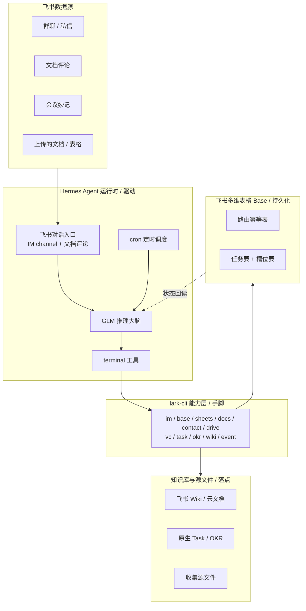

# 飞书数字员工

围绕飞书协作场景的常驻智能体,提供两类能力:被动沉淀公司知识库,主动收集结构化信息。系统以 Hermes Agent 为运行时、飞书 CLI(lark-cli)为能力层、飞书多维表格(Base)为持久化层,在飞书生态内闭环运行,不依赖任何外部数据库。

完整设计与实现契约见 [personal/飞书数字员工-设计与实现.md](personal/飞书数字员工-设计与实现.md)。

## 目录

- [系统架构](#系统架构)
- [能力构成](#能力构成)
- [技术栈与分层职责](#技术栈与分层职责)
- [数据持久化模型](#数据持久化模型)
- [数据流](#数据流)
- [目录结构](#目录结构)
- [部署](#部署)
- [测试](#测试)

## 系统架构

系统分为三层:Hermes Agent 运行时负责驱动(对话入口、推理、命令执行、定时调度);lark-cli 能力层承担一切飞书数据读写;飞书多维表格持久化层承载全部运行状态。两条能力线共用同一套三层底座。



| 层 | 组件 | 职责 |
|---|---|---|
| 运行时 | Hermes Agent | 飞书对话入口、GLM 推理、terminal 调用 lark-cli、cron 定时心跳、技能挂载 |
| 能力层 | lark-cli | 飞书全部数据读写:消息收发与加急、多维表格、电子表格、文档、通讯录、云空间、会议纪要、任务、OKR、知识库、事件订阅 |
| 持久化层 | 飞书多维表格 Base | 全部运行状态;知识库线用路由幂等表,收集线用任务表与槽位表 |

每次处理均为无状态循环:从 Base 读状态,GLM 推理决策,经 terminal 调 lark-cli 执行,再写回 Base。状态存于飞书云端,跨重启不丢失,可在飞书内直接审计。

## 能力构成

系统由两条技能线构成,各自为独立、可移植的 agentskills.io 技能,位于 [skills/](skills/)。

### 信息收集助手(feishu-collector)

主动收集。发起人上传含待填信息的文档或表格并下达指令,系统在群内或私信主动对话收集,逐项收齐后清洗、确认、写回源文件,并自动催办、收工汇报。

- 三种收集形态:表格按行收集、问题清单向特定人、开放式登记。
- 四种责任人来源:文件责任人列、指令点名、全群认领、通讯录智能匹配。
- 两道确认闸:向真人发问前的发起确认,写回文件前的复述确认。
- 内置清洗归一化:身份证、尺码、邮箱、日期等格式校验与归一,不合格自动追问。
- 定期催办:按间隔与上限挑选未交项提醒,临近截止升级为飞书加急。
- 幂等保障:写回侧以内容指纹去重,发送侧以幂等键防重复发问,抗重启不重复。

### 知识库自动维护(feishu-kb-maintainer)

被动沉淀。监听会议、群聊与文档协作,抽取要点并写入以飞书 Wiki 为骨架的知识库,涵盖七项功能。

- 会议沉淀:会议结束后抓取妙记纪要,按主题路由追加至对应项目文档。
- 群聊沉淀:按时间窗批量抽取决策、结论、待办、FAQ,过滤闲聊后更新沉淀页。
- 待办维护:将行动项写为飞书原生 Task,文档侧维护只读镜像。
- 战略目标维护:识别与关键结果相关的进展,写入原生 OKR 进展记录。
- 文档评论智能回复:读取文档正文与评论上下文,在评论串内回复。
- 智能路由与幂等:决定每条来源写入的目标文档、任务或 OKR,并按内容指纹去重。
- 周期汇总:定时将散落的决策、待办、进展汇编为周报页。

## 技术栈与分层职责

| 技术 | 角色 | 说明 |
|---|---|---|
| Hermes Agent | 运行时 | 提供 GLM 推理大脑、飞书对话入口(IM channel 与文档评论)、terminal 命令执行、cron 调度、技能挂载目录 |
| 飞书 CLI(lark-cli) | 能力层 | 经 Hermes terminal 调用,承担一切飞书数据操作;命令面以实测版本为准 |
| 飞书多维表格(Base) | 持久化层 | 全部运行状态存于飞书,不引入 SQLite 或外部数据库 |
| GLM | 推理 | 知识库线的要点抽取与目标识别,收集线的计划生成、答案映射与人名消歧 |

Hermes 对飞书的写入能力经由 terminal 调用 lark-cli 完成;其内置飞书集成仅覆盖消息收发、文档读取与评论,不含数据写入,故 lark-cli 为能力层的必要组成。

## 数据持久化模型

全部状态以飞书多维表格承载。字段定义见设计文档第四章。

### 路由幂等表(知识库线)

| 字段 | 含义 |
|---|---|
| source_type | meeting / chat / comment / manual |
| source_id | 妙记 minute_token、消息 message_id、群与时间窗、评论 comment_id |
| source_meta | 会议主题、群名、文档标题、时间 |
| target_kind | doc / task / okr / comment |
| target_id | 文档 document_id、节点 token、任务标识、关键结果标识 |
| target_locator | 落点定位:文档块、单元格、记录加字段、评论串 |
| content_hash | 内容指纹,判断是否需要更新 |
| status | written / updated / skipped |
| last_synced_at | 最近同步时间 |

### 任务表(收集线,一条记录对应一次收集活动)

主键 task_id,记录标题、状态、场所、发起群、发起人、源文件、目标文件、截止时间、催办策略、原始指令、收集计划摘要与时间戳。

### 槽位表(收集线,一条记录对应一个待收集信息点)

主键 slot_id,关联 task_id,记录字段名、对象、责任人、落点、值、状态、内容指纹、追问次数、最近询问时间与来源。状态取值:待问、已问、收到原始、清洗中、待确认、已填、跳过、不适用、待澄清。

## 数据流

### 收集线

1. 发起人在群内提及机器人并附文件,或收集对象在私信回复,经 Hermes 飞书对话入口接入。
2. GLM 读取技能指令决策,经 terminal 调 lark-cli:解析源文件结构、解析人名、发起提问与回复、写回目标、记录任务与槽位状态。
3. cron 触发催办心跳,遍历进行中任务,挑选未交项发送提醒,临近截止升级加急。

### 知识库线

1. 会议结束后由妙记生成事件触发,取纪要后查路由幂等表定位目标,追加纪要并写入待办与进展。
2. 群聊由消息事件或定时拉取触发,按时间窗累积后抽取要点,查表去重后更新沉淀页。
3. 文档评论经提及触发,读取文档正文与评论上下文后在评论串内回复。
4. cron 定时汇编周期内的决策、待办、进展为周报页。

## 目录结构

```
.
├── README.md
├── personal/
│   └── 飞书数字员工-设计与实现.md          设计与实现契约(单一真相源)
├── docs/
│   ├── pipeline/
│   │   └── env-capabilities.yaml          lark-cli 命令面与权限实测记录
│   └── superpowers/
│       └── plans/                         收集线实施计划
└── skills/                               分层架构：共享底座 + 领域原子 + 编排器
    ├── feishu-shared/                     共享底座(lib，被原子与编排器 import)
    │   ├── SKILL.md
    │   ├── src/                           底座: larkcli, hash, base-crud;
    │   │                                  I/O 能力: message, contact, file, cell-write,
    │   │                                  doc, minutes, chat, task, okr, comment, im-util;
    │   │                                  体检: health
    │   └── test/
    ├── atoms/                             领域逻辑原子(各含 src + test + SKILL.md)
    │   ├── collect-store/                 任务表/槽位表 CRUD
    │   ├── collect-clean/                 清洗归一化
    │   ├── collect-slot-fsm/              槽位状态机
    │   ├── collect-nudge/                 催办挑选
    │   ├── collect-wrapup/                收工汇报(到期/全收齐)
    │   ├── kb-extract/                    抽取归类
    │   ├── kb-route/                      路由幂等 + 覆盖保护
    │   ├── kb-digest/                     周报素材选取
    │   ├── kb-scaffold/                   知识库骨架(冷启动建标准节点树)
    │   └── kb-interview/                  通用访谈模板(冷启动主动问)
    ├── feishu-init/                       编排器·书童引导(欢迎/体检/冷启动)
    │   ├── SKILL.md
    │   ├── package.json
    │   ├── src/                           intent(意图分类), cards(欢迎/菜单/体检文案)
    │   ├── bin/                           init
    │   └── test/
    ├── feishu-collector/                  编排器·信息收集助手
    │   ├── SKILL.md                       工作流指令(大脑/编排)
    │   ├── package.json
    │   └── bin/                           setup-base, on-message, tick
    └── feishu-kb-maintainer/              编排器·知识库自动维护
        ├── SKILL.md
        ├── package.json
        └── bin/                           setup-route-base, on-event, digest
```

## 部署

### 一、安装 lark-cli（飞书官方 CLI）

> ⚠️ **必须使用官方包 `@larksuite/cli`**，不要安装第三方同名包（如 `feishu-cli`，功能不同且不兼容）。

```bash
npm install -g @larksuite/cli
lark-cli --version   # 确认安装成功
```

### 二、创建飞书应用 & 初始化 lark-cli 配置

1. **创建应用并获取凭证：**

```bash
lark-cli config init --new --force-init
```

如果命令因 Hermes 环境变量干扰卡住，先清除再运行：

```bash
env -u HERMES_HOME -u HERMES_CONFIG -u HERMES_PROFILE lark-cli config init --new --force-init
```

2. **绑定到 Hermes：**

```bash
lark-cli config bind
```

这会自动将 App ID / Secret 写入 `~/.hermes/config.yaml` 的 `feishu` 平台配置和 `~/.hermes/.env`。

### 三、配置 Hermes 飞书连接

`lark-cli config bind` 通常会自动写入以下配置。如果没有，手动确认 `~/.hermes/config.yaml` 包含：

```yaml
feishu:
  enabled: true
  connection_mode: websocket    # WebSocket 模式，无需公网回调地址
```

`~/.hermes/.env` 包含：

```env
FEISHU_APP_ID=cli_xxxxxxxxxxxx
FEISHU_APP_SECRET=xxxxxxxxxxxx
FEISHU_DOMAIN=feishu           # 国内版飞书用 feishu，海外版 Lark 用 lark
FEISHU_CONNECTION_MODE=websocket
```

重启 Gateway 使配置生效：

```bash
hermes gateway restart
```

### 四、批准飞书配对

启动 Gateway 后，Hermes 终端会显示一个 7 位配对码（如 `QHLNC8B3`），执行：

```bash
hermes pairing approve feishu <配对码>
```

配对成功后飞书 Bot 即可收发消息。

### 五、用户身份授权

lark-cli 以 user 身份创建 Base（Bot 身份通常缺少 `base:table:create` 权限）。

```bash
lark-cli auth login --device-code
```

终端会输出一个 URL，在浏览器中打开并登录飞书账号完成授权。授权完成后终端显示登录成功。

如需完整 scope 覆盖：

```bash
lark-cli auth login --scope "contact:user:search base:table:create base:table:read base:field:create base:field:read base:field:update base:view:write_only base:record:create base:record:read base:record:update sheets:spreadsheet:read sheets:spreadsheet:write_only vc:note:read task:task:write task:task:read okr:okr.progress:writeonly okr:okr.period:readonly docx:document:readonly docx:document:write_only wiki:space:read wiki:node:read wiki:node:create offline_access"
```

### 六、创建状态库 Base

用 user 身份运行建表脚本（需要先完成上一步授权）：

```bash
# 收集线：任务表 + 槽位表
node skills/feishu-collector/bin/setup-base.js

# 知识库线：路由幂等表
node skills/feishu-kb-maintainer/bin/setup-route-base.js
```

将输出的 app_token 和 table_id 写入 `~/.hermes/.env`：

```env
COLLECTOR_APP_TOKEN=SNCTbUxxxxxxxxxx
COLLECTOR_TASKS_TABLE=tblXpnMCxxxxxxxxxx
COLLECTOR_SLOTS_TABLE=tblXuxb9xxxxxxxxxx
KB_APP_TOKEN=BTzbbKxxxxxxxxxx
KB_ROUTE_TABLE=tblhXxfoxxxxxxxxxx
```

### 七、安装 Skills 到 Hermes

将本项目 skills 目录挂载到 Hermes：

```bash
cp -r skills/feishu-init ~/.hermes/skills/
cp -r skills/feishu-collector ~/.hermes/skills/
cp -r skills/feishu-kb-maintainer ~/.hermes/skills/
cp -r skills/feishu-shared ~/.hermes/skills/
cp -r skills/atoms ~/.hermes/skills/
```

在技能目录执行 `npm install` 安装运行依赖（仅开发与测试需要，生产运行依赖 lark-cli）。

### 八、飞书开放平台权限

登录 [飞书开放平台](https://open.feishu.cn/app) → 应用管理 → 权限管理，开通以下权限并**发布新版本**使其生效：

| 权限 | 用途 |
|---|---|
| `im:message` / `im:message:send_as_bot` | 收发消息 |
| `bitable:app` | 多维表格读写 |
| `wiki:wiki` / `wiki:space` / `wiki:node` | 知识库读写 |
| `docx:document` | 云文档读写 |
| `vc:note` | 会议妙纪读取 |
| `task:task` | 原生任务读写 |
| `okr:okr` | OKR 读写 |
| `im:message.group_msg`（敏感） | 群聊全量读取，需管理员审批；未获批时退化为机器人被 @ 提及时归档 |

### 前置条件摘要

- **lark-cli**：官方 `@larksuite/cli`，已完成 `config init` 和 `config bind`
- **Hermes Gateway**：运行中，飞书 WebSocket 已连接
- **用户授权**：`lark-cli auth login` 完成（用于创建 Base）
- **状态库**：收集线任务表 + 槽位表、知识库线路由表已创建
- **Skills**：已挂载到 `~/.hermes/skills/`
- **环境变量**：`~/.hermes/.env` 中所有 token 已写入
- **应用权限**：飞书开放平台权限已开通并发布版本

### 验证

```bash
# 确认 Gateway 运行 + 飞书连接
hermes status | grep -A2 Feishu

# 确认环境变量就位
grep -E "FEISHU|COLLECTOR|KB_" ~/.hermes/.env

# 确认 Skills 已安装
ls ~/.hermes/skills/ | grep feishu
```

在飞书上给机器人发"你好"，确认书童引导正常响应。

## 多公司部署（多 Profile + Kanban）

当你需要为多家公司各跑一个飞书数字员工时，不要在一个 profile 上塞所有东西。用 Hermes 的 **Profile + Kanban** 机制：

- 每家公司一个独立 profile（独立 SOUL.md、.env、Gateway、会话、记忆）
- 总指挥 profile（微信/Telegram）通过 Kanban 看板分派任务给各 worker

### 架构

```
┌─────────────────────────┐
│  default profile (总指挥)  │  ← 微信/Telegram，只连一个 IM
│  Kanban dispatcher       │
└────┬──────────┬──────────┘
     │          │
     ▼          ▼
┌──────────┐ ┌──────────┐
│ worker-A │ │ worker-B │ ...  ← 每个公司一个 profile，只连飞书
│ (公司A)   │ │ (公司B)   │
└──────────┘ └──────────┘
```

**关键：每个 profile 独立运行自己的 Gateway 进程。** 两个 profile 连同一个飞书 App 会导致 WebSocket 抢连——每个公司必须有独立的飞书应用（独立 App ID/Secret）。

### 步骤

**1. 为每家公司创建飞书应用**

在飞书开放平台为每家公司各创建一个应用，分别拿到 App ID / Secret。每个应用有独立的 bot 身份和权限。

**2. 为每家公司创建 Hermes profile**

```bash
hermes profile create worker-A --description "公司A飞书数字员工：信息收集 + 知识库维护"
hermes profile create worker-B --description "公司B飞书数字员工：信息收集 + 知识库维护"
```

**3. 配置每个 worker profile**

对每个 profile，编辑 `~/.hermes/profiles/<name>/` 下的三个文件：

`.env` — 飞书凭证 + 该公司的 Base Token（只写必要的，不要从 default clone 过来一大堆无关变量）：

```env
FEISHU_APP_ID=cli_xxx
FEISHU_APP_SECRET=xxx
FEISHU_DOMAIN=feishu
FEISHU_CONNECTION_MODE=websocket
FEISHU_HOME_CHANNEL=oc_xxx
COLLECTOR_APP_TOKEN=xxx
COLLECTOR_TASKS_TABLE=xxx
COLLECTOR_SLOTS_TABLE=xxx
KB_APP_TOKEN=xxx
KB_ROUTE_TABLE=xxx
```

`config.yaml` — 只启用飞书，禁用其他平台：

```bash
worker-A config set platforms.feishu.enabled true
worker-A config set platforms.feishu.connection_mode websocket
worker-A config set platforms.weixin.enabled false
# 设置 model 和 provider（跟 default 一致即可）
worker-A config set model.default <model>
worker-A config set model.provider <provider>
worker-A config set model.base_url <url>
worker-A config set model.api_key <key>
```

`SOUL.md` — 写入该公司的数字员工身份。可直接使用本项目 `config/SOUL.md` 模板，或根据公司场景微调。

**4. 安装 Skills 到每个 worker profile**

```bash
cp -r skills/feishu-init ~/.hermes/profiles/worker-A/skills/
cp -r skills/feishu-collector ~/.hermes/profiles/worker-A/skills/
cp -r skills/feishu-kb-maintainer ~/.hermes/profiles/worker-A/skills/
cp -r skills/feishu-shared ~/.hermes/profiles/worker-A/skills/
cp -r skills/atoms ~/.hermes/profiles/worker-A/skills/
```

**5. 创建该公司的 Base**

用 lark-cli 以 user 身份为该公司创建状态库（每家公司独立的 Base）：

```bash
lark-cli auth login --device-code   # 用该公司飞书应用授权
node skills/feishu-collector/bin/setup-base.js
node skills/feishu-kb-maintainer/bin/setup-route-base.js
```

将输出的 token 写入对应 profile 的 `.env`。

**6. 安装 Gateway 服务并启动**

```bash
worker-A gateway install   # 安装 systemd service
worker-A gateway start      # 启动
```

**7. 批准配对**

每个 worker profile 首次启动后需要在飞书上发消息触发配对：

```bash
worker-A pairing approve feishu <配对码>
```

**8. 初始化 Kanban 看板**

在总指挥 profile（default）上初始化：

```bash
hermes kanban init    # 自动发现所有 profile
```

之后总指挥创建任务、分配给 worker，Gateway 内置 dispatcher 每 60 秒自动 tick 分发。

### 避坑

- **不要手动建 profile 目录**。用 `hermes profile create`，否则缺 profile.yaml、alias、systemd service。
- **不要 clone .env**。`--clone` 会把 default 的所有环境变量带过来（包括微信凭证等无关变量），应该手动写干净的 .env。
- **model 配置要完整**。`config.yaml` 的 `model:` 块下必须有 `default`、`provider`、`base_url`、`api_key`，缺任何一个都会报 `No LLM provider configured`。
- **不要反复重启 Gateway**。所有配置改完验证后再一次性重启。每次重启断开所有平台连接。
- **每个飞书应用必须独立**。两个 profile 不能连同一个飞书应用的 WebSocket。

## 测试

两条线均以单元测试覆盖确定性核心(幂等指纹、状态机、清洗归一、催办挑选、路由决策、抽取去重),不依赖网络。

```
node --test skills/feishu-collector/test/*.test.js
node --test skills/feishu-kb-maintainer/test/*.test.js
```

依赖真实飞书环境的集成测试由环境变量门控,在提供授权与测试沙箱标识后运行。

## 设计文档

[personal/飞书数字员工-设计与实现.md](personal/飞书数字员工-设计与实现.md) 为系统的设计与实现契约,涵盖功能定义、总体架构、数据模型、数据流、各功能实现路径、关键机制与部署细节。
