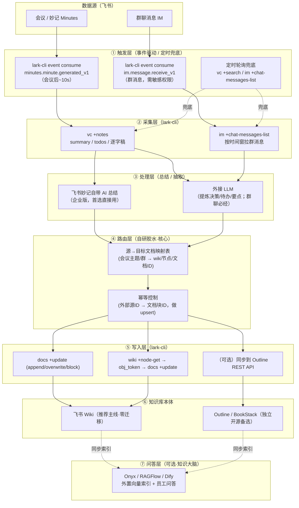

# 飞书知识库自动维护机器人 · 架构设计

> 目标：一个机器人，**会议结束后自动抓取会议内容更新文档**，并**读取群聊信息更新对应文档**，持续维护公司知识库。
> 本文重点：用**现成开源方案**搭建，最小化自研；明确**怎么集成**、**有哪些坑**、**分几步落地**。
> 配套：详细的方案盘点与对比见同目录 [`开源方案调研-盘点与对比.md`](开源方案调研-盘点与对比.md)。
> 编写日期：2026-06。

---

## 0. 一句话结论

> **触发用长连接事件、采集用 `lark-cli`、总结用飞书自带的妙记 AI（或外接 LLM）、知识库本体优先用「飞书 Wiki」（零迁移）或「Outline」（独立开源），问答能力再叠加 Onyx/RAGFlow。整条链路 80% 有现成轮子，自研只剩「路由 + 幂等 + 编排」这层胶水。**

---

## 1. 总体架构（分层）



**七层职责：**

| 层 | 职责 | 现成方案 | 自研量 |
|---|---|---|---|
| ① 触发 | 感知"会议结束/有新群消息" | `lark-cli event consume`（长连接，免公网） | 低 |
| ② 采集 | 拉会议纪要/群消息原文 | `lark-cli vc +notes` / `im +chat-messages-list` | 低 |
| ③ 处理 | 总结、抽取决策/待办/要点 | 飞书妙记 AI（会议）/ 外接 LLM（群聊） | 中 |
| ④ 路由 | 决定"写到哪个文档" + 去重 | 无现成，**核心自研** | **高** |
| ⑤ 写入 | 把内容追加/覆盖进文档 | `lark-cli docs +update` / `wiki` | 低 |
| ⑥ 知识库 | 文档存储与协作 | 飞书 Wiki / Outline / BookStack | 0 |
| ⑦ 问答 | 语义检索 + 员工自助问答 | Onyx / RAGFlow / Dify（外置） | 中 |

> **关键洞察**：现成轮子覆盖了①②③⑤⑥，真正要写的代码集中在 **④ 路由层**（源→文档映射 + 幂等 upsert）。这是项目的工作量重心，也是质量分水岭——**不做幂等就会重复写、覆盖错文档**。

---

## 2. 数据流详解

### 2.1 会议 → 文档（绿灯，官方有现成原型）

```
[会议结束] 
  → 事件 minutes.minute.generated_v1（~10s 后妙记就绪）
  → lark-cli vc +recording 取 minute_token / 或事件直接带 token
  → lark-cli vc +notes --minute-tokens <token>   # 拿 summary + todos + 逐字稿
  → (企业版妙记已含 AI 总结，可直接用；否则外接 LLM 二次总结)
  → 路由：按会议主题/关联日历/参会群 → 命中目标 wiki 节点或文档
  → lark-cli docs +update --api-version v2 (append 一段「YYYY-MM-DD 会议纪要」)
```

- **官方现成流水线**：`lark-cli` 自带 `lark-workflow-meeting-summary` 技能，已实现 `vc +search`（按时间找会议）→ `vc +notes`（取纪要）→ `drive metas`（拿链接）→ `docs +create`（生成总结文档）。**这是会议→文档的 80% 成品**，缺的只是：把它从"手动/定时批量"改成"由 `minutes.minute.generated_v1` 事件自动触发单场会议"。
- **鉴权注意**：该流水线用 **user identity（用户身份 OAuth）**，不是纯 bot token。要无人值守，需用一个"服务账号"完成一次 OAuth 授权并保存 token（本机已完成过 device-flow 授权，token 持久化在本地）。

### 2.2 群聊 → 文档（黄/红灯，有权限门槛）

```
[群有新消息]
  → 事件 im.message.receive_v1（实时）  或  定时 im +chat-messages-list（按时间窗批量）
  → 累积一个时间窗/达到N条 → 触发处理（避免每条都写）
  → 外接 LLM 提炼：决策 / 结论 / 待办 / FAQ（群聊必须 LLM，原始消息不能直接进知识库）
  → 路由：群 chat_id → 对应文档（映射表）
  → lark-cli docs +update (append/block-replace 维护「群聊沉淀」小节)
```

- **🔴 最大门槛——权限**：机器人**默认只能收到 @ 它的群消息**。要读群内**全量**消息（含未 @ 它的），需要高敏感权限 `im:message.group_msg`（实时）或 `im:message.history:readonly`（拉历史），**两者都需企业管理员审批 + 应用发布审核**，官方明示"如非必要不建议申请"。
  → **务必在立项前确认管理员是否批准**。批不下来时，退而求其次的合规形态是：**只沉淀 @机器人 的消息**（例如约定"群里 @机器人 + 关键词"来主动归档），或让机器人作为群成员、由群主显式授权。
- **降噪设计**：群消息信噪比低，**绝不能逐条写文档**。必须：① 按时间窗（如每天/每小时）或消息数批量；② LLM 只抽"有沉淀价值的"（决策、结论、待办、答疑），丢弃闲聊；③ 写入前与既有内容去重。

---

## 3. 知识库选型：三条路线

> 用户问"现成开源知识库方案"。务实地分三条路线，**推荐按团队现状选**，不是非此即彼。

### 路线 A —— 知识库就用「飞书 Wiki」（✅ 推荐主线）
- **逻辑**：公司已在飞书办公，员工天然在飞书里看文档，**零迁移、零额外运维**。机器人用 `lark-cli wiki/docs` 直接写飞书知识库。
- **优点**：链路最短；权限/协作/搜索/移动端飞书全包；`lark-cli` 原生支持写入。
- **代价**：知识库"锁"在飞书生态；无开放向量检索（问答需外置，见路线 C）。
- **写入方式**：`wiki +node-get` 拿节点的 `obj_token`（即 docx document_id）→ `docs +update` 改正文。（wiki API 管节点结构，**正文一律走 docx 接口**。）

### 路线 B —— 独立开源知识库（飞书只当数据源）
适合"知识库要独立于飞书、可自托管、可对外/跨系统"的场景。**首选 Outline，次选 BookStack**：

| 方案 | 协议 | 为何适合机器人写入 | 写入 API |
|---|---|---|---|
| **Outline** 🥇 | BSL 1.1（自托管内部免费） | RPC 风格 REST，`text` 字段**直接吃 Markdown**，可建文档/改文档/组织目录树 | `POST /api/documents.create {title,text,collectionId}` |
| **BookStack** 🥈 | **MIT**（最干净） | 部署最轻（PHP+MySQL），Shelf→Book→Chapter→Page 固定层级**让机器人最易推理"放哪"** | `POST /api/pages {book_id,name,markdown}` |
| **SiYuan 思源** 🥉 | AGPL-3.0 | 中文/隐私优先，`createDocWithMd` 一次调用用 Markdown 建文档 | `POST /api/filetree/createDocWithMd {notebook,path,markdown}` |

> ⚠️ 避坑：AFFiNE/AppFlowy 人气最高（69k/72k★）但 **API 非官方/不稳定，不要选做机器人后端**；Docmost 社区版无写入 API（要企业版）；Obsidian/Logseq 的 API 依赖桌面客户端常驻，不适合做无人值守服务端。

### 路线 C —— 叠加「问答大脑」（RAG，可选增强）
- **事实**：上面所有自托管知识库**都没有内置向量/语义检索**。若要"员工对知识库自助问答"，必须**外置 RAG**。
- **方案**：**Onyx（原 Danswer）** 最像"公司知识大脑"——权限感知检索、40+ connector、混合检索；**RAGFlow** 检索质量口碑最佳。**但两者都无飞书 connector**，需用 `lark-cli` 把飞书文档/纪要拉出来推进去（自建胶水）。
- **关系**：知识库（飞书Wiki/Outline）= 存储与协作；Onyx/RAGFlow = 索引与问答。**互补，不替代**。

---

## 4. 集成方案：三套技术栈组合

### 组合 ①：CLI 脚本化（最贴合现状，已装 `lark-cli`）
```
lark-cli event consume  →  Node/Python 编排脚本  →  lark-cli vc/im 采集
                        →  LLM(可选)  →  路由+幂等  →  lark-cli docs/wiki 写入
```
- **适合**：已经在用 `lark-cli`、想要最少依赖、全代码可控。
- **优点**：无需额外部署平台；触发(`event consume`)、采集、写入全是一条 `lark-cli` 命令；本机已完成飞书授权。
- **自研**：一个常驻进程 + 路由映射表 + 幂等存储（SQLite 即可）。

### 组合 ②：低代码 n8n（运维/IT 主导，可视化）
```
n8n (Lark Trigger 节点)  →  n8n AI/LLM 节点  →  n8n HTTP/Lark 节点写飞书或 Outline
```
- **适合**：不想写代码、要可视化维护、IT 主导的团队。
- **现成**：社区节点 [`n8n-nodes-feishu-lark`](https://github.com/zhgqthomas/n8n-nodes-feishu-lark) 提供 **Lark Trigger（国内 WebSocket / 国际 Webhook）+ Bot + MCP** 三类节点 + Parse Message + Send-and-Wait（人在环路）。
- **协议洁癖**：把 n8n 换成 **Activepieces（MIT）**。

### 组合 ③：全自研 + 问答大脑（中大型团队）
```
oapi-sdk(WebSocket长连接)  →  自建服务/Windmill  →  LLM  →  飞书Wiki/Outline 存储
                                                         →  Onyx/RAGFlow 建索引+问答
```
- **适合**：有研发资源，既要沉淀文档又要员工问答、要严格编排与可观测。

> **推荐**：先用**组合①**做 MVP（最快验证"会议→文档"闭环），需要可视化或非技术同事维护时迁移到**组合②**，需要问答时叠加**组合③**的 Onyx/RAGFlow。

---

## 5. 现成可复用清单（直接抄/参考）

| 项目 | 用途 | 复用价值 |
|---|---|---|
| **`larksuite/cli`**（官方，~13.6k★） | 2500+ API、26 个 AI Skill，覆盖 IM/Docs/Wiki/Minutes/VC/Event | ★★★ 整条链路的基础工具，已装 |
| **`lark-workflow-meeting-summary`**（CLI 内置技能） | 会议→纪要→生成总结文档 的端到端流水线 | ★★★ 会议线 80% 成品 |
| **`lark-cli event`**（长连接事件） | 免公网回调的事件订阅 | ★★★ 触发层直接用 |
| **`larksuite/oapi-sdk-*`**（官方 SDK Py/Go/Java/Node） | WebSocket 长连接 + 全 OpenAPI | ★★★ 全自研基础设施 |
| **`n8n-nodes-feishu-lark`**（社区） | n8n 飞书触发/收发节点 | ★★ 低代码编排 |
| **Onyx / RAGFlow**（开源 RAG） | 权限感知问答 / 高质量检索 | ★★ 问答大脑（需自建飞书胶水） |
| **`ConnectAI-E/feishu-openai`**（~5.6k★） | 飞书 AI bot（含语音转写、文档导出） | ★ 群聊总结改造参考 |

---

## 6. 关键风险与前置条件（立项前必须确认）

| # | 风险/前置 | 影响 | 应对 |
|---|---|---|---|
| 1 | **群全量消息读取是敏感权限** `im:message.group_msg` | 🔴 批不下来则"读群聊"只能限于 @机器人 的消息 | 立项前找企业管理员确认审批；备选"@机器人主动归档"形态 |
| 2 | **妙记 AI 总结依赖企业套餐** | 🟡 免费版可能只有转写无 AI 总结 | 确认租户套餐；无 AI 总结则外接 LLM 兜底 |
| 3 | **写目标文档需机器人是协作者且有编辑权** | 🟡 否则 403 | 机器人建的文档天然有权；写存量文档要先加协作者 |
| 4 | **会议线现成流水线用 user identity** | 🟡 非纯 bot，需 OAuth | 用服务账号一次性授权，token 持久化（本机已做） |
| 5 | **幂等/去重** | 🟡 不做会重复写、写错文档 | 路由层维护「外部源ID→文档/块ID」映射做 upsert（SQLite） |
| 6 | **群消息信噪比** | 🟡 逐条写会污染知识库 | 时间窗批量 + LLM 只抽有价值内容 + 写前去重 |
| 7 | **开源知识库均无内置向量检索** | 🟡 RAG 问答要外置 | 选 Markdown 原生(Outline/BookStack)让同步管线最省 |
| 8 | **协议合规** | 🟢 内部自用基本无忧 | Outline=BSL、n8n=SUL、Windmill=AGPL 对外/转售有限制；BookStack/Activepieces/Onyx-CE=MIT/Apache 最宽松 |

---

## 7. 分阶段落地路线图

| 阶段 | 目标 | 交付 | 依赖 |
|---|---|---|---|
| **P0 · MVP**（1-2周） | 跑通"**会议→飞书文档**"单闭环 | `lark-cli event` 监听妙记生成 → `vc +notes` → 路由到固定文档 → `docs +update` 追加纪要 | 妙记套餐、服务账号授权 |
| **P1 · 群聊线**（2-3周） | "**群聊→文档**"，先做 @机器人 触发的合规形态 | `im` 事件/轮询 → LLM 抽要点 → 写对应文档；加幂等映射表 | ⚠️ 全量读取需等管理员审批 |
| **P2 · 路由智能化** | 自动判断"写哪个文档"（按主题/项目/群语义匹配） | 路由层引入 LLM/规则混合；映射表可视化管理 | — |
| **P3 · 问答大脑** | 员工对知识库自助问答 | 把飞书文档同步进 Onyx/RAGFlow 建向量索引；飞书 bot 作问答入口 | RAG 平台部署 |
| **P4 · 平台化** | 非技术同事可维护 | 迁移编排到 n8n；监控/告警/重试 | — |

---

## 8. 附录：`lark-cli` 相关命令速查（本机 v1.0.48 已验证）

```bash
# —— 触发层：长连接事件 ——
lark-cli event list                       # 列出所有可订阅 EventKey
lark-cli event schema <EventKey>          # 查事件字段结构
lark-cli event consume minutes.minute.generated_v1   # 监听妙记生成（会议线触发）
lark-cli event consume im.message.receive_v1         # 监听群消息（需敏感权限）

# —— 采集层：会议 ——
lark-cli vc +search --start-time ... --end-time ...  # 搜已结束会议（须至少一个过滤条件）
lark-cli vc +recording --meeting-ids <id>            # 取 minute_token
lark-cli vc +notes --minute-tokens <token>           # 取 summary/todos/逐字稿  ★核心
lark-cli minutes +download <token>                   # 下载妙记音视频（按需）

# —— 采集层：群聊 ——
lark-cli im +chat-search --query "群名"               # 按群名找 chat_id
lark-cli im +chat-messages-list --chat-id <id> \
    --start-time <ts> --end-time <ts> --sort-type ByCreateTimeAsc   # 拉群历史
lark-cli im +messages-search --query "关键词"         # 搜消息（user 身份）

# —— 写入层：文档 / 知识库 ——
lark-cli docs +fetch  --api-version v2 --doc <token> --doc-format markdown   # 读
lark-cli docs +update --api-version v2 --doc <token> ...   # append/overwrite/block 编辑 ★核心
lark-cli wiki +space-list                              # 列知识空间
lark-cli wiki +node-list --space-id <id>              # 列节点
lark-cli wiki +node-get --token <node_token>          # 拿节点 obj_token(→docx document_id)
lark-cli wiki +node-create ...                        # 建知识库节点
```

---

## 9. 来源

**飞书能力**：[larksuite/cli](https://github.com/larksuite/cli) · [lark-vc](https://github.com/larksuite/cli/blob/main/skills/lark-vc/SKILL.md) · [lark-workflow-meeting-summary](https://github.com/larksuite/cli/blob/main/skills/lark-workflow-meeting-summary/SKILL.md) · [im message/list](https://open.feishu.cn/document/server-docs/im-v1/message/list?lang=zh-CN) · [im.message.receive_v1](https://open.feishu.cn/document/server-docs/im-v1/message/events/receive?lang=zh-CN) · [docx block create](https://open.feishu.cn/document/server-docs/docs/docs/docx-v1/document-block/create?lang=zh-CN) · [长连接事件订阅](https://feishu.apifox.cn/doc-7518429)
**开源知识库**：[Outline](https://github.com/outline/outline) · [BookStack](https://github.com/BookStackApp/BookStack) · [SiYuan](https://github.com/siyuan-note/siyuan)
**编排/RAG**：[n8n-nodes-feishu-lark](https://github.com/zhgqthomas/n8n-nodes-feishu-lark) · [Onyx](https://github.com/onyx-dot-app/onyx) · [RAGFlow](https://github.com/infiniflow/ragflow) · [Dify](https://github.com/langgenius/dify)
